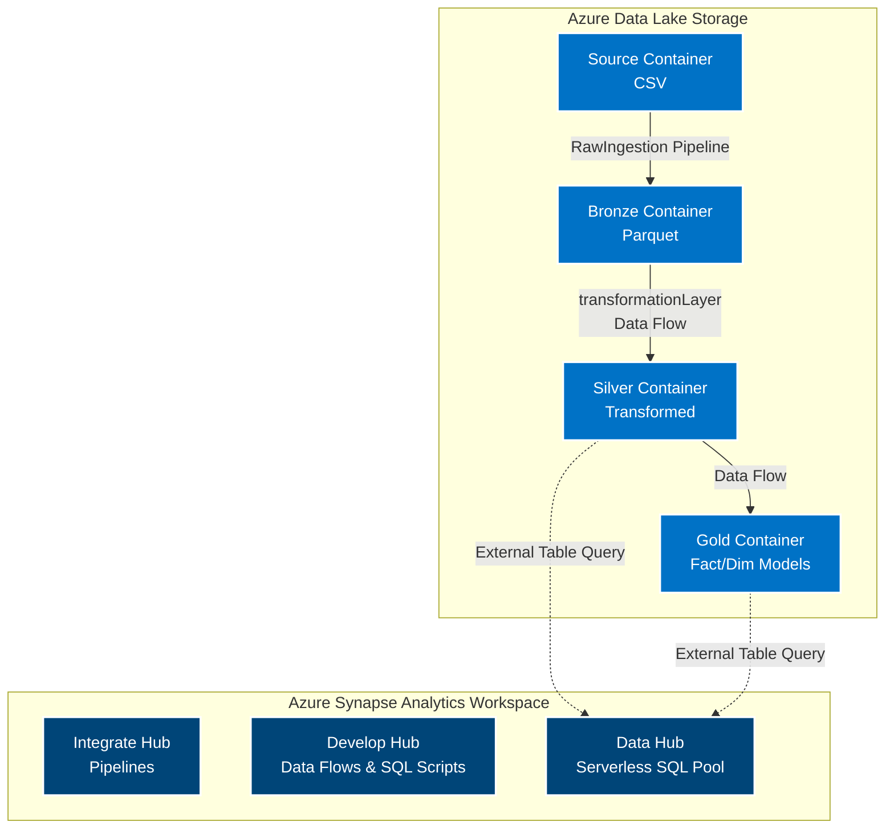

# ☁️ Azure Synapse Analytics: Serverless SQL & Medallion Datahouse

> A comprehensive data warehousing project built entirely within Azure Synapse Analytics. This architecture utilizes Synapse Pipelines for data movement, Spark-backed Data Flows for transformation, and Serverless SQL Pools to query external data sitting directly in a Data Lake via a structured Medallion Architecture (Bronze, Silver, Gold).

---

## 🏗️ Architecture Overview

The infrastructure consists of an Azure Synapse Analytics workspace seamlessly integrated with an Azure Data Lake Storage (ADLS Gen2) account. Data is ingested, transformed, and queried logically through three distinct layers.

## 🚀 Deployed Resources

| Resource Type | Purpose in Project |
| :--- | :--- |
| **Azure Synapse Analytics** | The unified workspace acting as the data warehouse. It handles orchestration (Pipelines), transformation (Data Flows), and compute/querying (Serverless SQL Pool). |
| **Azure Storage Account (ADLS Gen2)** | The underlying Data Lake containing logically separated containers for Source, Bronze, Silver, and Gold data. |

## 🏅 Medallion Architecture & Workspace Integration

This project is built using the three primary tabs/hubs inside the Synapse Workspace to execute the Medallion Data Lakehouse pattern.

### 1. Data Hub (Serverless SQL Pool)
Used to create a **Serverless SQL Pool Database**. This database does not store the data itself; instead, it utilizes **External Tables** layered on top of the physical Parquet/Delta files sitting in the Silver and Gold Data Lake containers. This allows for standard T-SQL querying directly against the data lake.

### 2. Integrate Hub (Pipelines)
Acts as the built-in Azure Data Factory to orchestrate data movement.

* **`RawIngestion` Pipeline:** Uses a Copy Activity to migrate raw CSV files from the Source container into the Bronze container. During this transit, the data format is converted from CSV to **Parquet** for better compression and performance.

* **`transformationLayer` Pipeline:** 
  * Uses a **Data Flow Activity** to transform the Bronze Parquet data and load it into the Silver container.
  * Connects to a **Script Activity** which automatically executes a T-SQL script to create/update the External Table on top of the newly generated Silver data using the Serverless SQL pool.

### 3. Develop Hub (Authoring & Scripts)
The engineering sandbox where the core logic was written and saved.
* **SQL Scripts:** Developed the foundational DDL scripts required for Serverless querying, including:
  * Creating Database Scoped Credentials (for secure ADLS access).
  * Defining External Data Sources and External File Formats.
  * Defining schemas and generating the External Tables for both the Silver layer and the Gold layer (Facts and Dimensions).
* **Data Flows:** Developed the visual Spark-based transformation logic mapped to the `transformationLayer` pipeline.

## 🚧 Roadblocks & Common Challenges

* **Serverless SQL Authentication:** 
  * *The Hurdle:* Querying the Data Lake from Synapse Serverless SQL requires precise security handshakes. Initially, the queries failed due to access restrictions.
  * *The Resolution:* Authored strict SQL scripts to create Master Keys and Database Scoped Credentials using Managed Identities, ensuring the Serverless pool had the exact RBAC permissions (Storage Blob Data Contributor) to read the ADLS Gen2 containers.
* **External Table Schemas vs. Data Flow Outputs:** 
  * *The Hurdle:* When generating external tables over Parquet files, column data types must perfectly match the metadata generated by the Spark Data Flow. Mismatches caused query failures.
  * *The Resolution:* Ensured explicit data type casting inside the Synapse Data Flow before writing to the Silver layer, making it perfectly predictable for the `CREATE EXTERNAL TABLE` scripts to map `VARCHAR` and `INT` types correctly.

## 💡 Key Learnings

* **Unified Workspace:** Transitioning from standalone ADF and SQL Server to Azure Synapse Analytics demonstrated the power of having orchestration, Spark transformations, and SQL compute all under one roof.
* **Serverless Cost-Efficiency:** Utilizing Serverless SQL Pools to query external tables directly on the data lake is highly cost-effective, as you only pay for the data processed per query, rather than keeping a dedicated SQL cluster running 24/7.
